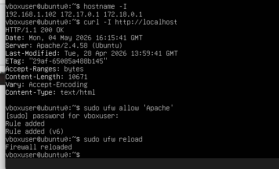
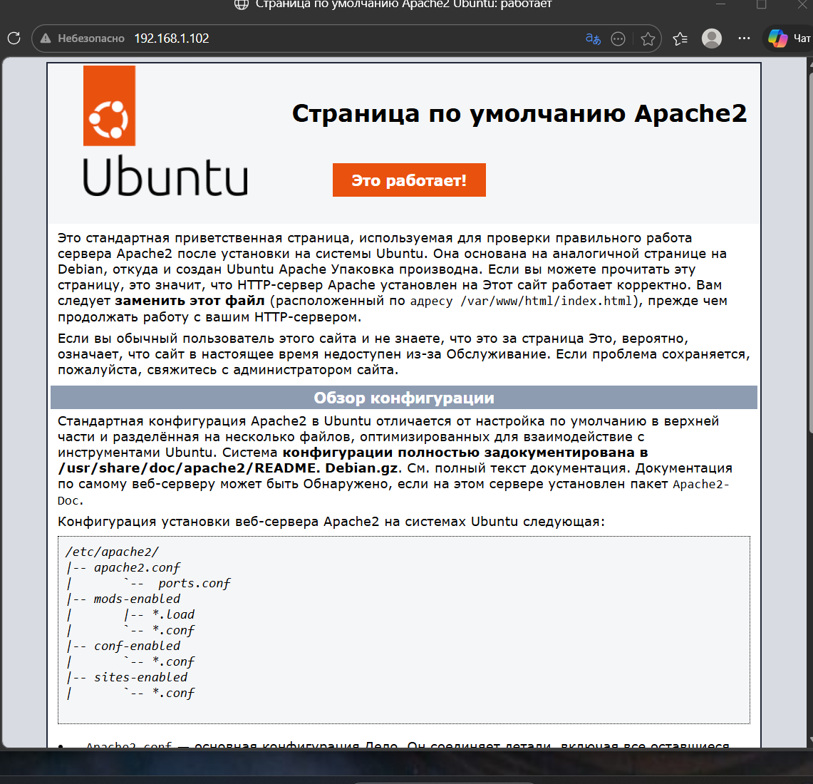
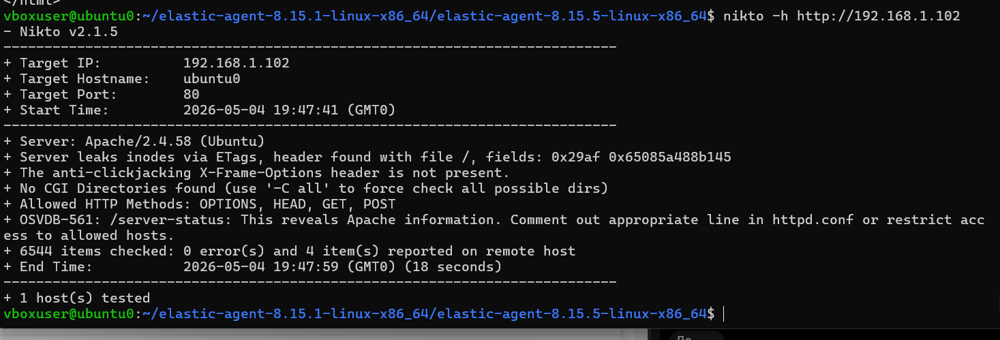
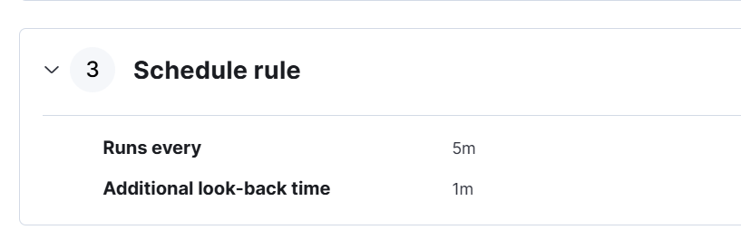
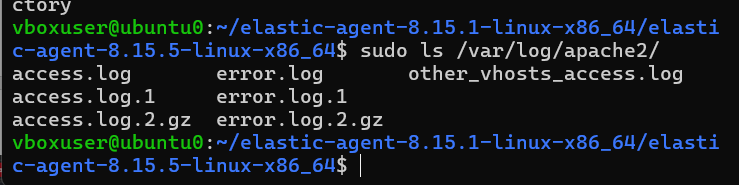

# ELK SIEM – Web Attack Detection

## Overview

This project demonstrates the deployment and configuration of the Elastic Stack (ELK) for collecting Apache web server logs and creating custom detection rules for web attack monitoring.

The project includes the installation of the Apache HTTP Server on Linux, configuration of the Apache integration in Elastic, verification of log ingestion, and creation of a custom detection rule within Kibana.

This laboratory project demonstrates practical experience with Security Information and Event Management (SIEM) technologies, Linux administration, and log management.

---

## Technologies

- Elasticsearch
- Logstash
- Kibana
- Apache HTTP Server
- Elastic Agent
- Linux
- SIEM

---

## Objectives

- Deploy Apache Web Server
- Configure Apache Integration
- Collect Apache Logs
- Verify Log Ingestion
- Create a Custom Detection Rule
- Configure Rule Severity
- Prepare ELK for Web Attack Detection

---

# Project Workflow

## Step 1 — System Update

Updated the Linux operating system before installing the required software packages.

---

## Step 2 — Apache Web Server Installation

Installed and configured the Apache HTTP Server.

Verified that the service was successfully installed and operational.

---

## Step 3 — Apache Installation Verification

Confirmed that the Apache installation completed successfully.

---

## Step 4 — Configure Apache Integration

Configured the Apache Integration within the Elastic Agent Policy.

This enables Apache logs to be collected automatically by Elasticsearch.

---

## Step 5 — Save Integration Configuration

Saved the integration settings and applied the configuration.

---

## Step 6 — Verify Log Collection

Verified that Apache log events were successfully ingested into Elasticsearch.

---

## Step 7 — Create a Custom Detection Rule

Created a Custom Query Detection Rule within Kibana to detect suspicious web activity.

---

## Step 8 — Configure Rule Severity

Assigned **High** severity to the detection rule according to the simulated attack scenario.

---

## Step 9 — Configuration Review

Reviewed the final ELK configuration before enabling the detection rule.

---

## Step 10 — Final Result

Successfully completed the deployment and configuration of an ELK SIEM environment capable of collecting Apache logs and supporting web attack detection through custom detection rules.

---

# Skills Demonstrated

- ELK Stack Deployment
- Elasticsearch Configuration
- Kibana Administration
- Apache Integration
- Elastic Agent Configuration
- Linux Administration
- Log Collection
- SIEM Fundamentals
- Detection Rule Configuration
- Web Attack Monitoring

---

# Learning Outcomes

Through this project I gained practical experience in:

- Deploying an ELK SIEM environment
- Installing and configuring Apache Web Server
- Integrating Apache logs with Elastic
- Configuring Elastic Agent policies
- Creating custom detection rules
- Working with Kibana Detection Engine
- Understanding SIEM workflow and log ingestion

---

# Author

**Nurshat Alzhan**

Cybersecurity Student

Astana IT University
