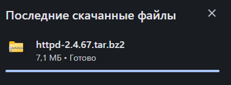
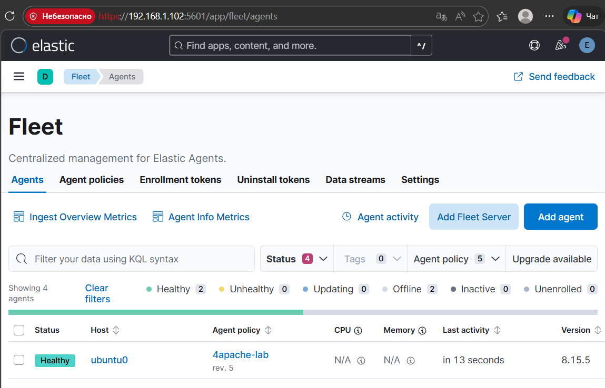
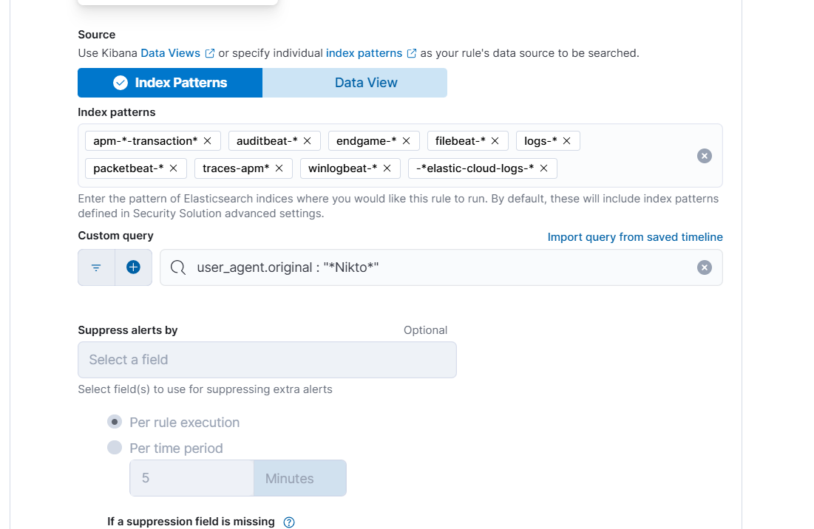
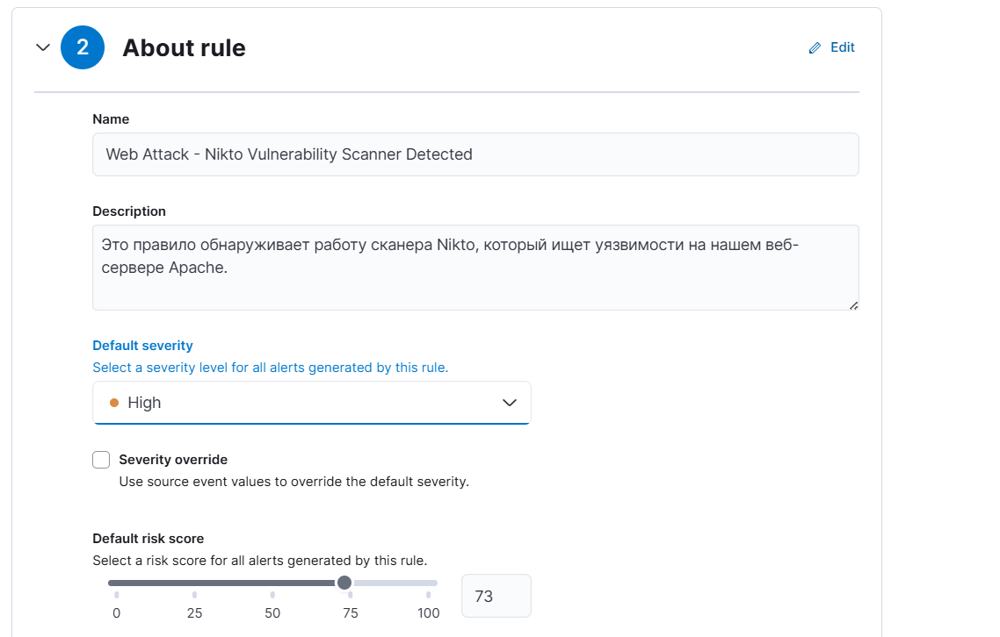
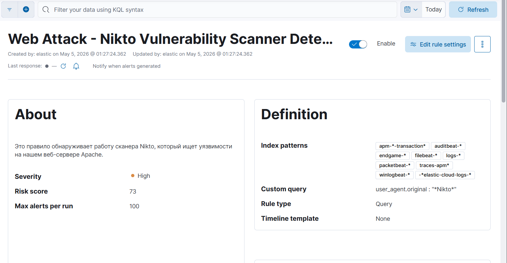

# ELK SIEM – Web Attack Detection

## Overview

This project demonstrates the deployment and configuration of the ELK Stack (Elasticsearch, Logstash, Kibana) for detecting web attacks through log analysis and custom detection rules.

The project was completed as part of a cybersecurity laboratory exercise focused on Security Information and Event Management (SIEM).

---

## Objectives

- Install and configure the ELK Stack
- Import and analyze web server logs
- Create detection rules
- Identify suspicious web activity
- Investigate alerts
- Document findings

---

## Technologies

- Elasticsearch
- Logstash
- Kibana
- Linux
- SIEM
- Log Analysis

---

## Skills Demonstrated

- SIEM Administration
- Log Analysis
- Threat Detection
- Security Monitoring
- Incident Investigation
- Detection Rule Configuration

---

## Project Workflow

### 1. Environment Setup

Configured the ELK Stack and prepared the environment for log collection.

---

### 2. Log Collection

Imported web server logs into Elasticsearch.

---

### 3. Kibana Configuration

Configured Kibana and verified data ingestion.

---

### 4. Detection Rule Creation

Created custom detection rules to identify suspicious web activity.

---

### 5. Alert Generation

Verified that alerts were generated when malicious events matched the rules.

---

### 6. Log Investigation

Investigated security events using Kibana dashboards.

---

### 7. Event Analysis

Reviewed logs and correlated suspicious activities.

---

### 8. Dashboard Visualization

Used Kibana dashboards for monitoring.

---

### 9. Results

Validated successful detection of malicious web activity.

---

### 10. Final Environment

Final SIEM environment after configuration.

---

## Learning Outcomes

During this project I learned how to:

- Deploy the ELK Stack
- Configure Kibana
- Create detection rules
- Analyze security logs
- Investigate alerts
- Monitor web attacks using a SIEM platform

---

## Author

Nurshat Alzhan

Astana IT University

Cybersecurity Student
